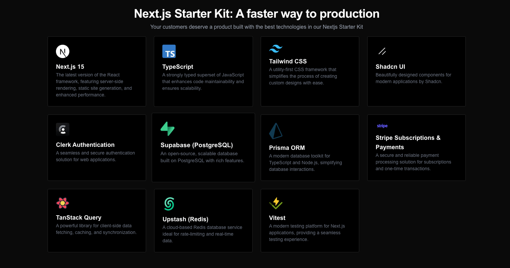

<a href="https://next-saas-stripe-starter.vercel.app">
  
  <h1 align="center">🚀 Next.js SaaS Starter Kit</h1>
</a>

<p align="center">
A modern, feature-rich starter kit for building SaaS applications with Next.js 14, authentication, payments, and more.

</p>


<p align="center">
  <a href="#-features"><strong>Features</strong></a> ·
  <a href="#-quick-start"><strong>Quick Start</strong></a> ·
  <a href="#-documentation"><strong>Documentation</strong></a> ·
  <a href="#-testing"><strong>Testing</strong></a> ·
  <a href="#-roadmap"><strong>Roadmap</strong></a> ·
  <a href="#-contributing"><strong>Contributing</strong></a> ·
  <a href="#-license"><strong>License</strong></a> ·
  <a href="#-support"><strong>Support</strong></a> ·
  <a href="#-links"><strong>Links</strong></a>
</p>
<br/>


## ✨ Features

- 🏗️ **Next.js 15** - The React framework for production
- 🔐 **Clerk** - Authentication with multiple providers
- 💳 **Stripe** - Subscription payments and billing
- 🎨 **Shadcn/ui** - Beautiful and accessible UI components
- 🗃️ **Prisma & Neon** - Type-safe database operations
- 📝 **MDX** - Content management with Markdown
- 🔍 **Command Menu** - Spotlight-like search with cmdk
- 🌙 **Dark Mode** - Light/dark mode with next-themes
- 📱 **Responsive** - Mobile-first design approach

## 🚗 Quick Start

```bash
# Clone the repository
git clone https://github.com/yourusername/next-saas-starter.git

# Install dependencies
pnpm install

# Set up environment variables
cp .env.example .env

# Start development server
bun run dev
```

## 📚 Documentation

Visit our [documentation](https://nextjs-saas-starterkit.vercel.app/docs) to learn more about:

## 🧪 Testing

```bash
# Run tests
bun run  test
```

## 🛣️ Roadmap

- [ ] Improve test coverage
- [ ] Add more payment providers
- [ ] Implement webhooks
- [ ] Add analytics
- [ ] Create more email templates


## 🤝 Contributing

We welcome contributions! Please read our [contributing guide](CONTRIBUTING.md) to get started.

## 📝 License

This project is licensed under the MIT License - see the [LICENSE](LICENSE) file for details.

## 💖 Support

If you find this project helpful, please consider:
- Giving it a ⭐️ on GitHub
- Sharing it with others

## 🔗 Links

- [Website](https://magesh-portfolio.vercel.app/)
- [Documentation](https://nextjs-saas-starterkit.vercel.app/docs)
- [GitHub Repository](https://github.com/mageshyt/nextjs-saas-starter)

## Credits & Thanks 🙏

This project wouldn't be possible without these amazing people:

- [@shadcn](https://twitter.com/shadcn) - For the incredible UI components and Taxonomy project that inspired this starter
- [@rasmickyy](https://x.com/rasmickyy) - For teaching and inspiring the implementation of SEO optimization, Stripe integration, and v1 SaaS architecture patterns
Special thanks to:
- The entire Next.js team for the amazing framework
- Vercel for their excellent hosting platform
- The open source community for their continuous support
### Additional Resources & Inspiration:
- [Magic UI Design System](https://magicui.design/docs/templates/startup)
- [NextJS Starter Kit by Michael Shimeles](https://github.com/michaelshimeles/nextjs-starter-kit)


This project is built on the shoulders of giants, and we're grateful for their contributions to the ecosystem.

---

Built with ❤️ by [MageshYT](https://x.com/yt_magesh)
